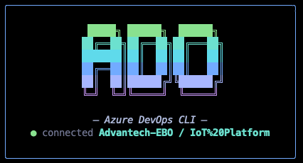

# ado — Azure DevOps CLI

[繁體中文](#繁體中文) | [English](#english)

---



## License

> Copyright (C) 2026 Rain Hu
> This program is free software: you can redistribute it and/or modify
it under the terms of the GNU General Public License as published by
the Free Software Foundation, version 3.

---

## 繁體中文

輕量級 Azure DevOps CLI 工具，提供 CLI 指令與互動式 TUI 介面，採用 CQRS + MediatR 模式設計。

### 前置需求

| 項目 | 版本 | 說明 |
|------|------|------|
| [Go](https://go.dev/dl/) | 1.24+ | 編譯所需 |
| [Git](https://git-scm.com/) | 任意 | PR 功能需要在 git repo 中執行 |
| Azure DevOps PAT | — | [建立 Personal Access Token](https://learn.microsoft.com/en-us/azure/devops/organizations/accounts/use-personal-access-tokens-to-authenticate) |

### 快速開始

```bash
# 1. 編譯
make build

# 2. 安裝到系統路徑（之後可直接用 ado 指令）
make install

# 3. 設定環境變數
cp .env.example .env
# 編輯 .env 填入你的 Azure DevOps 設定

# 4. 啟動 TUI
ado tui
```

#### 跨平台編譯

```bash
# 編譯全部平台（linux/darwin/windows × amd64/arm64）
make cross

# 產出在 dist/ 目錄下
ls dist/
```

### 安裝與設定

```bash
go build -o ado .
```

複製 `.env.example` 為 `.env` 並填入：

```
ADO_ORG=https://dev.azure.com/your-org
ADO_PROJECT=your-project
ADO_PAT=your-personal-access-token
ADO_QUERY_ID=your-saved-query-id
ADO_ASSIGNEE=your-display-name       # 選填，新建工作項目時的預設指派人
```

> 可透過 `ADO_ENV` 環境變數指定 `.env` 路徑，方便切換不同組織設定。

### CLI 指令

#### `ado query` — 查詢工作項目

執行已儲存的 Azure DevOps Query，列出工作項目。

```bash
# 使用 .env 中預設的 query ID
ado query

# 指定 query ID
ado query -i <query-id>
```

| 旗標 | 說明 |
|------|------|
| `-i, --id` | Query ID（覆蓋 ADO_QUERY_ID） |

#### `ado new <title>` — 建立工作項目

```bash
# 建立 Task（預設類型）
ado new "修復登入問題"

# 建立 Bug，附帶描述與標籤
ado new "API 回應錯誤" --type bug --desc "回傳 500" --tags "backend; urgent"

# 指定預估工時
ado new "實作新功能" --est 8
```

| 旗標 | 說明 | 預設值 |
|------|------|--------|
| `-t, --type` | 工作項目類型（task, bug, epic, issue, user story） | task |
| `-d, --desc` | 描述 | |
| `-e, --est` | 預估工時（小時） | 6 |
| `--tags` | 標籤，以分號分隔 | |

#### `ado pr [title]` — Pull Request

不帶參數時列出我的 PR；帶 title 時建立新 PR。

```bash
# 列出所有指派給我的 PR
ado pr

# 從目前分支建立 PR
ado pr "新增登入功能" -r "John Doe"

# 建立 PR 並啟用自動完成
ado pr "修復 #123" -d "修正問題描述" --auto-complete
```

| 旗標 | 說明 | 預設值 |
|------|------|--------|
| `-n, --branch` | 目標分支 | repo 預設分支 |
| `-d, --desc` | PR 描述 | |
| `-r, --reviewer` | 必要審查者（名稱或 email） | |
| `-o, --optional` | 選擇性審查者 | |
| `--auto-complete` | 啟用自動完成（squash merge + 刪除來源分支） | false |

#### `ado model` — 管理 LLM 模型設定檔

把 provider / model / API key 等設定存成獨立的 profile，隨時切換，不必每次改 `~/.ado/config.yaml`。Profile 存放於 `~/.ado/models/<name>.yaml`，當前啟用的名稱寫在 `~/.ado/models/current.txt`。

```bash
# 新增 profile（claude / openai / gemini 需要 --api-key）
ado model add sonnet claude claude-sonnet-4-20250514 \
  --api-key sk-ant-... -d "Anthropic default"

ado model add gpt4 openai gpt-4o-mini --api-key sk-...

ado model add gemini-flash gemini gemini-2.5-flash --api-key ...

# ollama 只需要 --base-url（預設 http://localhost:11434）
ado model add local ollama llama3.2 --base-url http://localhost:11434

# 列出 / 切換 / 移除
ado model ls
ado model select gpt4
ado model current
ado model rm sonnet
```

| 子命令 | 說明 |
|--------|------|
| `add <name> <provider> <model>` | 新增 profile（provider：`claude` / `openai` / `gemini` / `ollama`） |
| `ls` | 列出全部 profile，`*` 標記啟用中的 |
| `select <name>` | 切換啟用 profile |
| `current` | 顯示目前啟用的 profile |
| `rm <name>` | 刪除 profile |

啟用中的 profile 會覆寫 `~/.ado/config.yaml` 的 `llm:` 區塊；TUI Settings 的 LLM 區也多了「Profile」項目可直接切換。

#### `ado tui` — 啟動互動式介面

```bash
ado tui
ado tui -i <query-id>
```

---

### TUI 互動式介面

啟動後進入主選單，使用方向鍵或 `j`/`k` 瀏覽，`Enter` 選擇，`q` 離開。

#### 主選單

| 選項 | 功能 |
|------|------|
| Query | 瀏覽已儲存查詢的工作項目 |
| New | 建立新工作項目（精靈式引導） |
| Pull Requests | 瀏覽與建立 PR |
| Settings | 檢視與編輯 .env 設定 |

#### Query 畫面

互動式表格，可直接編輯工作項目欄位。

| 按鍵 | 動作 |
|------|------|
| `j` / `k` 或 `↑` / `↓` | 瀏覽列 |
| `Enter` | 選取列 → 進入欄位選擇 |
| `h` / `l` 或 `←` / `→` | 切換欄位（選取模式） |
| `Enter`（欄位上） | 編輯該欄位 |
| `d` | 在瀏覽器中開啟工作項目 |
| `n` | 建立新工作項目 |
| `r` | 重新整理 |
| `Esc` | 返回上一層 |

**可編輯欄位：** Tags、State（下拉選單）、Title、Estimate、Remaining

#### New 畫面（建立精靈）

依序填寫以下步驟：

1. **Type** — 選擇工作項目類型
2. **Tags** — 多選標籤（`Space` 切換，`a` 新增）
3. **Title** — 輸入標題
4. **Description** — 輸入描述（可按 Enter 跳過）
5. **Estimate** — 預估工時（預設 6）
6. **Confirm** — 確認並建立

#### Pull Requests 畫面

**分類選單：**

| 分類 | 說明 |
|------|------|
| Created by me | 我建立的 PR |
| Assigned to me | 指派給我的 PR |
| Assigned to me (required) | 我是必要審查者的 PR |
| Browse by repository | 依 repo 瀏覽 |

**PR 列表按鍵：**

| 按鍵 | 動作 |
|------|------|
| `Enter` | 在瀏覽器中開啟 PR |
| `n` | 建立新 PR（自動偵測目前 repo） |
| `r` | 重新整理 |
| `f` | 加入/移除最愛（repo 列表中） |

**審查狀態圖示：** `✓` 已核准 · `⏳` 等待作者 · `✗` 已拒絕 · `○` 待審查

**建立 PR 精靈：** 輸入標題 → 描述 → 目標分支 → 審查者 → 自動完成 → 確認

#### Settings 畫面

直接在 TUI 中編輯 `.env` 設定值（Org、Project、PAT、Query ID、Assignee）。

---

### 快取

工具會在執行目錄下建立 `.ado_cache.json`，快取以下資料：
- 標籤列表
- 最愛的 repo
- 上次使用的審查者名稱

---

### 架構

```
cmd/                    # Cobra CLI 指令
internal/
  cqrs/                 # Mediator — Request / Handler / PipelineBehavior
  behaviors/            # Behavior pipeline（Logging）
  features/             # 每個 use case 獨立一個 handler
    query/              #   └─ GetQuery: 依 query ID 取得工作項目
    create/             #   └─ CreateWorkItem: 建立工作項目
    pr/                 #   └─ ListMyPRs / CreatePR: PR 操作
  api/                  # Azure DevOps REST API client
  tui/                  # Bubble Tea 互動式介面
  config/               # 環境變數設定
  cache/                # 本地快取
  git/                  # Git 操作工具
```

---

## English

Lightweight Azure DevOps CLI tool with both CLI commands and an interactive TUI, built with a CQRS + MediatR-style architecture.

### Prerequisites

| Item | Version | Notes |
|------|---------|-------|
| [Go](https://go.dev/dl/) | 1.24+ | Required for building |
| [Git](https://git-scm.com/) | any | PR features require a git repo |
| Azure DevOps PAT | — | [Create a Personal Access Token](https://learn.microsoft.com/en-us/azure/devops/organizations/accounts/use-personal-access-tokens-to-authenticate) |

### Quick Start

```bash
# 1. Build
make build

# 2. Install to system PATH (use `ado` from anywhere)
make install

# 3. Configure
cp .env.example .env
# Edit .env with your Azure DevOps settings

# 4. Launch TUI
ado tui
```

#### Cross-platform Build

```bash
# Build for all platforms (linux/darwin/windows × amd64/arm64)
make cross

# Output in dist/
ls dist/
```

### Setup

```bash
go build -o ado .
```

Copy `.env.example` to `.env` and fill in:

```
ADO_ORG=https://dev.azure.com/your-org
ADO_PROJECT=your-project
ADO_PAT=your-personal-access-token
ADO_QUERY_ID=your-saved-query-id
ADO_ASSIGNEE=your-display-name       # optional, default assignee for new items
```

> Use `ADO_ENV` environment variable to specify a custom `.env` path for switching between orgs.

### CLI Commands

#### `ado query` — List work items

Run a saved Azure DevOps query and display work items.

```bash
# Use default query ID from .env
ado query

# Specify a query ID
ado query -i <query-id>
```

| Flag | Description |
|------|-------------|
| `-i, --id` | Query ID (overrides ADO_QUERY_ID) |

#### `ado new <title>` — Create a work item

```bash
# Create a Task (default type)
ado new "Fix login bug"

# Create a Bug with description and tags
ado new "API error" --type bug --desc "Returns 500" --tags "backend; urgent"

# Specify estimate hours
ado new "Implement feature" --est 8
```

| Flag | Description | Default |
|------|-------------|---------|
| `-t, --type` | Work item type (task, bug, epic, issue, user story) | task |
| `-d, --desc` | Description | |
| `-e, --est` | Estimate in hours | 6 |
| `--tags` | Semicolon-separated tags | |

#### `ado pr [title]` — Pull requests

Without arguments: list my PRs. With a title: create a new PR from the current branch.

```bash
# List all PRs assigned to me
ado pr

# Create PR from current branch
ado pr "Add login feature" -r "John Doe"

# Create PR with auto-complete
ado pr "Fix #123" -d "Fix description" --auto-complete
```

| Flag | Description | Default |
|------|-------------|---------|
| `-n, --branch` | Target branch | repo default branch |
| `-d, --desc` | PR description | |
| `-r, --reviewer` | Required reviewer (name or email) | |
| `-o, --optional` | Optional reviewer | |
| `--auto-complete` | Enable auto-complete (squash merge + delete source) | false |

#### `ado model` — Manage LLM model profiles

Save provider / model / API key combinations as named profiles and switch between them without editing `~/.ado/config.yaml`. Profiles live in `~/.ado/models/<name>.yaml` and the active one is tracked in `~/.ado/models/current.txt`.

```bash
# Add profiles
ado model add sonnet claude claude-sonnet-4-20250514 \
  --api-key sk-ant-... -d "Anthropic default"

ado model add gpt4 openai gpt-4o-mini --api-key sk-...

ado model add gemini-flash gemini gemini-2.5-flash --api-key ...

# ollama only needs --base-url (defaults to http://localhost:11434)
ado model add local ollama llama3.2 --base-url http://localhost:11434

# List / switch / remove
ado model ls
ado model select gpt4
ado model current
ado model rm sonnet
```

| Subcommand | Description |
|------------|-------------|
| `add <name> <provider> <model>` | Create a profile (provider: `claude` / `openai` / `gemini` / `ollama`) |
| `ls` | List all profiles (`*` marks the active one) |
| `select <name>` | Make a profile active |
| `current` | Show the active profile |
| `rm <name>` | Delete a profile |

The active profile overlays the `llm:` section from `~/.ado/config.yaml`. The TUI Settings screen also exposes a `Profile` entry under LLM for one-click switching.

#### `ado tui` — Launch interactive TUI

```bash
ado tui
ado tui -i <query-id>
```

---

### TUI Interactive Interface

After launch, you enter the main menu. Use arrow keys or `j`/`k` to navigate, `Enter` to select, `q` to quit.

#### Main Menu

| Item | Function |
|------|----------|
| Query | Browse work items from a saved query |
| New | Create a new work item (step-by-step wizard) |
| Pull Requests | Browse and create PRs |
| Settings | View and edit .env configuration |

#### Query Screen

Interactive table with inline editing of work item fields.

| Key | Action |
|-----|--------|
| `j` / `k` or `Up` / `Down` | Navigate rows |
| `Enter` | Select row -> enter column selection |
| `h` / `l` or `Left` / `Right` | Switch columns (select mode) |
| `Enter` (on field) | Edit the field |
| `d` | Open work item in browser |
| `n` | Create new work item |
| `r` | Refresh |
| `Esc` | Go back |

**Editable columns:** Tags, State (dropdown), Title, Estimate, Remaining

#### New Screen (Creation Wizard)

Step-by-step wizard:

1. **Type** — Select work item type
2. **Tags** — Multi-select tags (`Space` to toggle, `a` to add new)
3. **Title** — Enter title
4. **Description** — Enter description (press Enter to skip)
5. **Estimate** — Estimate hours (default: 6)
6. **Confirm** — Review and create

#### Pull Requests Screen

**Category menu:**

| Category | Description |
|----------|-------------|
| Created by me | PRs I created |
| Assigned to me | PRs where I'm a reviewer |
| Assigned to me (required) | PRs where I'm a required reviewer |
| Browse by repository | Browse PRs by repo |

**PR list keys:**

| Key | Action |
|-----|--------|
| `Enter` | Open PR in browser |
| `n` | Create new PR (auto-detects current repo) |
| `r` | Refresh |
| `f` | Toggle favorite (in repo list) |

**Review status icons:** `✓` Approved · `⏳` Waiting · `✗` Rejected · `○` Pending

**Create PR wizard:** Title -> Description -> Target branch -> Reviewer -> Auto-complete -> Confirm

#### Settings Screen

Edit `.env` values directly in the TUI (Org, Project, PAT, Query ID, Assignee).

---

### Cache

The tool creates `.ado_cache.json` in the working directory, caching:
- Tag list
- Favorite repositories
- Last used reviewer names

---

### Architecture

```
cmd/                    # Cobra CLI commands
internal/
  cqrs/                 # Mediator — Request / Handler / PipelineBehavior
  behaviors/            # Behavior pipeline (Logging)
  features/             # One handler per use case
    query/              #   └─ GetQuery: fetch work items by query ID
    create/             #   └─ CreateWorkItem: create work items
    pr/                 #   └─ ListMyPRs / CreatePR: PR operations
  api/                  # Azure DevOps REST API client
  tui/                  # Bubble Tea interactive interface
  config/               # Environment-based configuration
  cache/                # Local cache persistence
  git/                  # Git integration utilities
```
