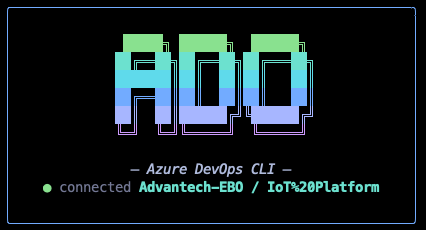

# ado — Azure DevOps CLI

[繁體中文](#繁體中文) | [English](#english)

---



## License

> Copyright (C) 2026 Rain Hu
> This program is free software: you can redistribute it and/or modify
it under the terms of the GNU General Public License as published by
the Free Software Foundation, version 3.

---

## 繁體中文

輕量級 Azure DevOps CLI 工具，提供 CLI 指令與互動式 TUI 介面，採用 CQRS + MediatR 模式設計。支援工作項目（查詢／建立／更新／搬移／刪除）、Pull Request、Pipeline 監看，以及由 LLM 產生的週報摘要。

### 前置需求

| 項目 | 版本 | 說明 |
|------|------|------|
| [Go](https://go.dev/dl/) | 1.24+ | 編譯所需 |
| [Git](https://git-scm.com/) | 任意 | PR 與 summary 功能需要 git repo |
| Azure DevOps PAT | — | [建立 Personal Access Token](https://learn.microsoft.com/en-us/azure/devops/organizations/accounts/use-personal-access-tokens-to-authenticate) |

### 快速開始

```bash
# 1. 編譯
make build

# 2. 安裝到系統路徑（之後可直接用 ado 指令）
make install

# 3. 建立設定檔
mkdir -p ~/.ado
$EDITOR ~/.ado/config.yaml   # 內容見下方「安裝與設定」

# 4. 啟動 TUI
ado tui
```

#### 跨平台編譯

```bash
# 編譯全部平台（linux/darwin/windows × amd64/arm64）
make cross

# 產出在 dist/ 目錄下
ls dist/
```

### 安裝與設定

設定檔位於 `~/.ado/config.yaml`，環境變數（`ADO_ORG`、`ADO_PROJECT`、`ADO_PAT`、`ADO_QUERY_ID`、`ADO_ASSIGNEE`）可覆寫對應欄位：

```yaml
org: "Advantech-EBO"              # org 名稱或完整 URL 皆可
project: "your-project"
pat: "your-personal-access-token"
query_id: "your-saved-query-id"   # 選填：ado query 的預設 query
assignee: "Your Display Name"     # 選填：新建工作項目時的預設指派人

summary:                          # 選填：ado summary / ado commits 使用
  days: 7                         # 回溯天數
  repos:                          # 要掃描 commit 的 repo 路徑（預設為目前目錄）
    - ~/work/repo1
    - ~/work/repo2
  authors:                        # git author 過濾條件（OR 比對），留空表示不過濾
    - "Rain Hu"
    - "rain.hu"
  template: ~/.ado/template.md    # 報告模板
  output: ~/.ado/reports          # 報告儲存目錄

llm:                              # 選填：ado summary 的 LLM 設定
  provider: claude                # claude / openai / gemini / ollama
  model: claude-sonnet-4-20250514
  api_key_env: ANTHROPIC_API_KEY  # 從環境變數讀 API key（或直接填 api_key）
  max_tokens: 4096
```

> `llm:` 區塊會被啟用中的 model profile 覆寫，見 [`ado model`](#ado-model--管理-llm-模型設定檔)。

### CLI 指令

#### `ado query` — 查詢工作項目

執行已儲存的 Azure DevOps Query，列出工作項目。

```bash
# 使用 config 中預設的 query ID
ado query

# 指定 query ID
ado query -i <query-id>
```

| 旗標 | 說明 |
|------|------|
| `-i, --id` | Query ID（覆蓋 query_id 設定） |

#### `ado new <title>` — 建立工作項目

```bash
# 建立 Task（預設類型）
ado new "修復登入問題"

# 建立 Bug，附帶描述與標籤
ado new "API 回應錯誤" --type bug --desc "回傳 500" --tags "backend; urgent"

# 指定預估工時並掛在 parent 之下
ado new "實作新功能" --est 8 --parent 12345
```

| 旗標 | 說明 | 預設值 |
|------|------|--------|
| `-t, --type` | 工作項目類型（task, bug, epic, issue, user story / story） | task |
| `-d, --desc` | 描述 | |
| `-e, --est` | 預估工時（小時），同時設定 remaining | 6 |
| `--tags` | 標籤，以分號分隔 | |
| `-p, --parent` | 父工作項目 ID（建立 parent link） | |

#### `ado update <id>` — 更新工作項目

更新既有工作項目的欄位；只有你傳入的旗標會被改動（對應 Query TUI 的可編輯欄位）。

```bash
# 切換狀態
ado update 1234 --state Active

# 同時改標題與預估工時
ado update 1234 --title "新標題" --est 4

# 改標籤與剩餘工時
ado update 1234 --tags "frontend; urgent" --remaining 2
```

| 旗標 | 說明 |
|------|------|
| `-T, --title` | 新標題 |
| `-s, --state` | 新狀態（New、Active、Closed…） |
| `--tags` | 標籤，以分號分隔（取代既有） |
| `-e, --est` | 預估工時（小時） |
| `--remaining` | 剩餘工時（小時） |

#### `ado move <id> [id...]` — 搬移迭代

把一個或多個工作項目搬到指定迭代（sprint）。

```bash
# 搬到目前 sprint
ado move 1234 --current

# 依名稱搬移多筆
ado move 1234 5678 --iteration "Sprint 12"
```

| 旗標 | 說明 |
|------|------|
| `-i, --iteration` | 目標迭代名稱或路徑（先比對 path，再比對 name：完全相符 → 子字串） |
| `--current` | 搬到團隊目前 sprint |

#### `ado rm <id> [id...]` — 刪除工作項目

把工作項目送進資源回收筒（可於 Web UI 還原）；預設會詢問確認。別名：`ado delete`。

```bash
ado rm 1234
ado rm 1234 5678 9012
ado rm 1234 --yes        # 跳過確認
```

| 旗標 | 說明 |
|------|------|
| `-y, --yes` | 跳過確認提示 |

#### `ado pr [title]` — Pull Request

不帶參數時列出 PR；帶 title 時建立新 PR。列表分類旗標互斥，優先序：`--repo` > `--created` > `--assigned` > `--required`。

```bash
# 列出我是必要審查者的 PR（預設）
ado pr

# 我建立的 / 指派給我（任一審查者）的 PR
ado pr --created
ado pr --assigned

# 列出某 repo 的 active PR
ado pr --repo my-service

# 從目前分支建立 PR
ado pr "新增登入功能" -r "John Doe"

# 建立 PR 並啟用自動完成
ado pr "修復 #123" -d "修正問題描述" --auto-complete
```

| 旗標 | 說明 | 預設值 |
|------|------|--------|
| `--required` | 我是必要審查者的 PR | （預設） |
| `--assigned` | 我是任一審查者的 PR | |
| `--created` | 我建立的 PR | |
| `--repo` | 指定 repo 的 active PR（依名稱比對） | |
| `-n, --branch` | 目標分支 | repo 預設分支 |
| `-d, --desc` | PR 描述 | |
| `-r, --reviewer` | 必要審查者（名稱或 email） | |
| `-o, --optional` | 選擇性審查者 | |
| `--auto-complete` | 啟用自動完成（squash merge + 刪除來源分支） | false |

#### `ado pipeline` — Pipeline 狀態與 Build

```bash
# 列出全部 pipeline definitions 與最新 build 狀態
ado pipeline

# 顯示指定 pipeline 的最近 builds
ado pipeline -i 42

# 顯示最近 10 筆
ado pipeline -i 42 -t 10
```

| 旗標 | 說明 | 預設值 |
|------|------|--------|
| `-i, --id` | Pipeline definition ID（顯示其最近 builds） | |
| `-t, --top` | 顯示的 build 數量（搭配 `-i`） | 5 |

#### `ado commits` — 預覽 summary 會收集到的 commits

執行與 `ado summary` 相同的 commit 收集邏輯，但不呼叫 LLM。用來確認跨 repo 的 commit 是否被正確抓到。

```bash
ado commits                          # 使用 config 預設
ado commits -d 14                    # 回溯 14 天
ado commits -r /path/to/repo,/path2  # 覆寫 repo 列表
ado commits -a "Rain Hu,rain.hu"     # 覆寫 author 過濾（逗號分隔）
ado commits --raw                    # 機器可讀（tab 分隔，每行一筆）
```

| 旗標 | 說明 | 預設值 |
|------|------|--------|
| `-d, --days` | 回溯天數 | config 或 7 |
| `-r, --repos` | repo 路徑，逗號分隔（覆寫 config） | |
| `-a, --author` | author 過濾，逗號分隔（覆寫 summary.authors） | |
| `--raw` | tab 分隔輸出，方便程式處理 | false |

#### `ado summary` — 產生週報摘要

收集 git commits 與 ADO 工作項目，交由 LLM 產生摘要報告。需先設定 `llm:` 區塊或啟用 model profile。

```bash
ado summary                       # 使用 config 預設
ado summary -d 14                 # 回溯 14 天
ado summary -r /repo1,/repo2      # 指定 repos
ado summary -t ~/my-template.md   # 自訂模板
```

| 旗標 | 說明 | 預設值 |
|------|------|--------|
| `-d, --days` | 回溯天數 | config 或 7 |
| `-r, --repos` | repo 路徑，逗號分隔（覆寫 config） | |
| `-t, --template` | 報告模板路徑（覆寫 config） | `~/.ado/template.md` |

#### `ado model` — 管理 LLM 模型設定檔

把 provider / model / API key 等設定存成獨立的 profile，隨時切換，不必每次改 `~/.ado/config.yaml`。Profile 存放於 `~/.ado/models/<name>.yaml`，當前啟用的名稱寫在 `~/.ado/models/current.txt`。

```bash
# 新增 profile（claude / openai / gemini 需要 --api-key）
ado model add sonnet claude claude-sonnet-4-20250514 \
  --api-key sk-ant-... -d "Anthropic default"

ado model add gpt4 openai gpt-4o-mini --api-key sk-...

ado model add gemini-flash gemini gemini-2.5-flash --api-key ...

# ollama 只需要 --base-url（預設 http://localhost:11434）
ado model add local ollama llama3.2 --base-url http://localhost:11434

# 列出 / 切換 / 移除
ado model ls
ado model select gpt4
ado model current
ado model rm sonnet
```

| 子命令 | 說明 |
|--------|------|
| `add <name> <provider> <model>` | 新增 profile（provider：`claude` / `openai` / `gemini` / `ollama`） |
| `ls` | 列出全部 profile，`*` 標記啟用中的 |
| `select <name>` | 切換啟用 profile |
| `current` | 顯示目前啟用的 profile |
| `rm <name>` | 刪除 profile |

啟用中的 profile 會覆寫 `~/.ado/config.yaml` 的 `llm:` 區塊；TUI Settings 的 LLM 區也多了「Profile」項目可直接切換。

#### `ado tui` — 啟動互動式介面

```bash
ado tui
ado tui -i <query-id>
```

---

### TUI 互動式介面

啟動後進入主選單，使用方向鍵或 `j`/`k` 瀏覽，`Enter` 選擇，`q` 離開。

#### 主選單

| 選項 | 功能 |
|------|------|
| Query | 瀏覽已儲存查詢的工作項目 |
| New | 建立新工作項目（精靈式引導） |
| Pull Requests | 瀏覽與建立 PR |
| Pipelines | 瀏覽 pipeline definitions 與 builds |
| Summary | 產生週報摘要 |
| Settings | 檢視與編輯設定 |

#### Query 畫面

互動式表格，可直接編輯工作項目欄位，並支援過濾與批次操作。

| 按鍵 | 動作 |
|------|------|
| `j` / `k` 或 `↑` / `↓` | 瀏覽列 |
| `Enter` | 選取列 → 進入欄位選擇 |
| `h` / `l` 或 `←` / `→` | 切換欄位（選取模式） |
| `Enter`（欄位上） | 編輯該欄位 |
| `/` | 過濾列 |
| `Space` | 標記/取消標記目前列（多選） |
| `a` | 全選／清除選取 |
| `m` | 把選取（或目前）項目搬到其他迭代 |
| `D` | 批次刪除選取（或目前）項目（會確認） |
| `d` | 在瀏覽器中開啟工作項目 |
| `n` | 建立新工作項目 |
| `r` | 重新整理 |
| `Esc` | 返回上一層 |

**可編輯欄位：** Tags、State（下拉選單）、Title、Estimate、Remaining

#### New 畫面（建立精靈）

依序填寫以下步驟：

1. **Type** — 選擇工作項目類型
2. **Tags** — 多選標籤（`Space` 切換，`a` 新增）
3. **Title** — 輸入標題
4. **Description** — 輸入描述（可按 Enter 跳過）
5. **Estimate** — 預估工時（預設 6）
6. **Confirm** — 確認並建立

#### Pull Requests 畫面

**分類選單：**

| 分類 | 說明 |
|------|------|
| Created by me | 我建立的 PR |
| Assigned to me | 指派給我的 PR |
| Assigned to me (required) | 我是必要審查者的 PR |
| Browse by repository | 依 repo 瀏覽 |

**PR 列表按鍵：**

| 按鍵 | 動作 |
|------|------|
| `Enter` | 在瀏覽器中開啟 PR |
| `n` | 建立新 PR（自動偵測目前 repo） |
| `r` | 重新整理 |
| `f` | 加入/移除最愛（repo 列表中） |

**審查狀態圖示：** `✓` 已核准 · `⏳` 等待作者 · `✗` 已拒絕 · `○` 待審查

**建立 PR 精靈：** 輸入標題 → 描述 → 目標分支 → 審查者 → 自動完成 → 確認

#### Pipelines 畫面

| 按鍵 | 動作 |
|------|------|
| `↑` / `↓` | 瀏覽 pipeline / build |
| `Enter` | 檢視該 pipeline 的最近 builds |
| `d` | 在瀏覽器中開啟 |
| `r` | 重新整理 |
| `Esc` | 返回上一層 |

#### Summary 畫面

引導式流程：選擇要納入的工作項目（`Space` 切換、`a` 全選、`n` 全不選）→ 調整內容 → LLM 產生報告 → `s` 儲存報告至 `summary.output` 目錄（預設 `~/.ado/reports`）。

#### Settings 畫面

直接在 TUI 中編輯 `~/.ado/config.yaml`：

- **ADO 設定** — Org、Project、PAT、Query ID、Assignee
- **Summary 設定** — 天數、repos、模板、輸出目錄
- **LLM 設定** — Profile（子選單可切換／新增 profile，內建精靈）、Provider、Model、API key 等

---

### 快取與日誌

| 檔案 | 位置 | 內容 |
|------|------|------|
| `.ado_cache.json` | 執行檔所在目錄 | 標籤列表、最愛 repo、上次使用的審查者 |
| `ado-YYYY-MM-DD.log` | `~/.ado/logs/` | Mediator、HTTP、TUI 的執行日誌 |

---

### 架構

```
cmd/                    # Cobra CLI 指令
internal/
  cqrs/                 # Mediator — Request / Handler / PipelineBehavior
  behaviors/            # Behavior pipeline（Logging）
  features/             # 每個 use case 獨立一個 handler
    query/              #   └─ GetQuery: 依 query ID 取得工作項目
    create/             #   └─ CreateWorkItem: 建立工作項目
    update/             #   └─ UpdateWorkItem: 更新欄位
    move/               #   └─ MoveWorkItem: 搬移迭代
    remove/             #   └─ RemoveWorkItem: 刪除（資源回收筒）
    pr/                 #   └─ ListMyPRs / CreatePR: PR 操作
    pipeline/           #   └─ ListPipelines: pipeline 與 build 狀態
    summary/            #   └─ GenerateSummary / ResolveSummaryItems: 週報
  api/                  # Azure DevOps REST API client
  llm/                  # LLM provider（claude / openai / gemini / ollama）
  tui/                  # Bubble Tea 互動式介面
  config/               # ~/.ado/config.yaml + model profiles
  cache/                # 本地快取
  git/                  # Git 操作工具（commit 收集）
  logging/              # 檔案日誌（~/.ado/logs）
```

---

## English

Lightweight Azure DevOps CLI tool with both CLI commands and an interactive TUI, built with a CQRS + MediatR-style architecture. Covers work items (query / create / update / move / delete), pull requests, pipeline monitoring, and LLM-generated summary reports.

### Prerequisites

| Item | Version | Notes |
|------|---------|-------|
| [Go](https://go.dev/dl/) | 1.24+ | Required for building |
| [Git](https://git-scm.com/) | any | PR and summary features require git repos |
| Azure DevOps PAT | — | [Create a Personal Access Token](https://learn.microsoft.com/en-us/azure/devops/organizations/accounts/use-personal-access-tokens-to-authenticate) |

### Quick Start

```bash
# 1. Build
make build

# 2. Install to system PATH (use `ado` from anywhere)
make install

# 3. Configure
mkdir -p ~/.ado
$EDITOR ~/.ado/config.yaml   # see Setup below

# 4. Launch TUI
ado tui
```

#### Cross-platform Build

```bash
# Build for all platforms (linux/darwin/windows × amd64/arm64)
make cross

# Output in dist/
ls dist/
```

### Setup

Configuration lives in `~/.ado/config.yaml`. Environment variables (`ADO_ORG`, `ADO_PROJECT`, `ADO_PAT`, `ADO_QUERY_ID`, `ADO_ASSIGNEE`) override the corresponding fields:

```yaml
org: "Advantech-EBO"              # plain org name or full URL
project: "your-project"
pat: "your-personal-access-token"
query_id: "your-saved-query-id"   # optional: default query for `ado query`
assignee: "Your Display Name"     # optional: default assignee for new items

summary:                          # optional: used by `ado summary` / `ado commits`
  days: 7                        # look-back window
  repos:                         # repo paths to scan for commits (defaults to CWD)
    - ~/work/repo1
    - ~/work/repo2
  authors:                       # git author filters (OR'd); empty = no filter
    - "Rain Hu"
    - "rain.hu"
  template: ~/.ado/template.md   # report template
  output: ~/.ado/reports         # where saved reports go

llm:                              # optional: LLM settings for `ado summary`
  provider: claude               # claude / openai / gemini / ollama
  model: claude-sonnet-4-20250514
  api_key_env: ANTHROPIC_API_KEY # read API key from env (or set api_key directly)
  max_tokens: 4096
```

> The `llm:` section is overlaid by the active model profile — see [`ado model`](#ado-model--manage-llm-model-profiles).

### CLI Commands

#### `ado query` — List work items

Run a saved Azure DevOps query and display work items.

```bash
# Use default query ID from config
ado query

# Specify a query ID
ado query -i <query-id>
```

| Flag | Description |
|------|-------------|
| `-i, --id` | Query ID (overrides query_id config) |

#### `ado new <title>` — Create a work item

```bash
# Create a Task (default type)
ado new "Fix login bug"

# Create a Bug with description and tags
ado new "API error" --type bug --desc "Returns 500" --tags "backend; urgent"

# Specify estimate and link under a parent
ado new "Implement feature" --est 8 --parent 12345
```

| Flag | Description | Default |
|------|-------------|---------|
| `-t, --type` | Work item type (task, bug, epic, issue, user story / story) | task |
| `-d, --desc` | Description | |
| `-e, --est` | Estimate in hours (also sets remaining work) | 6 |
| `--tags` | Semicolon-separated tags | |
| `-p, --parent` | Parent work item ID to link under | |

#### `ado update <id>` — Update a work item

Update fields of an existing work item; only the flags you pass are changed (mirrors the inline-editable columns in the query TUI).

```bash
# Change state
ado update 1234 --state Active

# Change title and estimate together
ado update 1234 --title "New title" --est 4

# Change tags and remaining work
ado update 1234 --tags "frontend; urgent" --remaining 2
```

| Flag | Description |
|------|-------------|
| `-T, --title` | New title |
| `-s, --state` | New state (New, Active, Closed, …) |
| `--tags` | Semicolon-separated tags (replaces existing) |
| `-e, --est` | Original estimate in hours |
| `--remaining` | Remaining work in hours |

#### `ado move <id> [id...]` — Move to an iteration

Move one or more work items to a target iteration (sprint).

```bash
# Move to the current sprint
ado move 1234 --current

# Move several by name
ado move 1234 5678 --iteration "Sprint 12"
```

| Flag | Description |
|------|-------------|
| `-i, --iteration` | Target iteration name or path (matched by path, then name: exact → substring) |
| `--current` | Move to the team's current sprint |

#### `ado rm <id> [id...]` — Delete work items

Send work items to the recycle bin (restorable from the web UI); prompts for confirmation by default. Alias: `ado delete`.

```bash
ado rm 1234
ado rm 1234 5678 9012
ado rm 1234 --yes        # skip confirmation
```

| Flag | Description |
|------|-------------|
| `-y, --yes` | Skip the confirmation prompt |

#### `ado pr [title]` — Pull requests

Without arguments: list PRs. With a title: create a new PR from the current branch. The category flags are mutually exclusive; precedence: `--repo` > `--created` > `--assigned` > `--required`.

```bash
# List PRs where I'm a required reviewer (default)
ado pr

# PRs I created / where I'm any reviewer
ado pr --created
ado pr --assigned

# Active PRs in a specific repo
ado pr --repo my-service

# Create PR from current branch
ado pr "Add login feature" -r "John Doe"

# Create PR with auto-complete
ado pr "Fix #123" -d "Fix description" --auto-complete
```

| Flag | Description | Default |
|------|-------------|---------|
| `--required` | PRs where I'm a required reviewer | (default) |
| `--assigned` | PRs where I'm any reviewer | |
| `--created` | PRs I created | |
| `--repo` | Active PRs in the named repo (matched by name) | |
| `-n, --branch` | Target branch | repo default branch |
| `-d, --desc` | PR description | |
| `-r, --reviewer` | Required reviewer (name or email) | |
| `-o, --optional` | Optional reviewer | |
| `--auto-complete` | Enable auto-complete (squash merge + delete source) | false |

#### `ado pipeline` — Pipeline status and builds

```bash
# List all pipeline definitions with their latest build status
ado pipeline

# Show recent builds for a specific pipeline
ado pipeline -i 42

# Show the 10 most recent builds
ado pipeline -i 42 -t 10
```

| Flag | Description | Default |
|------|-------------|---------|
| `-i, --id` | Pipeline definition ID (show its recent builds) | |
| `-t, --top` | Number of recent builds to show (with `-i`) | 5 |

#### `ado commits` — Preview commits collected for summary

Runs the same commit-collection logic as `ado summary` without invoking the LLM. Useful for verifying which commits are picked up across your configured repos.

```bash
ado commits                          # use config defaults
ado commits -d 14                    # look back 14 days
ado commits -r /path/to/repo,/path2  # override repo list
ado commits -a "Rain Hu,rain.hu"     # override author filter (comma-separated)
ado commits --raw                    # machine-readable one-per-line
```

| Flag | Description | Default |
|------|-------------|---------|
| `-d, --days` | Days to look back | config or 7 |
| `-r, --repos` | Comma-separated repo paths (overrides config) | |
| `-a, --author` | Comma-separated author filters (overrides summary.authors) | |
| `--raw` | Tab-separated one-line-per-commit output | false |

#### `ado summary` — Generate a summary report

Collects git commits and ADO work items, then generates a report via LLM. Requires the `llm:` config section or an active model profile.

```bash
ado summary                       # use config defaults
ado summary -d 14                 # look back 14 days
ado summary -r /repo1,/repo2      # specific repos
ado summary -t ~/my-template.md   # custom template
```

| Flag | Description | Default |
|------|-------------|---------|
| `-d, --days` | Days to look back | config or 7 |
| `-r, --repos` | Comma-separated repo paths (overrides config) | |
| `-t, --template` | Report template path (overrides config) | `~/.ado/template.md` |

#### `ado model` — Manage LLM model profiles

Save provider / model / API key combinations as named profiles and switch between them without editing `~/.ado/config.yaml`. Profiles live in `~/.ado/models/<name>.yaml` and the active one is tracked in `~/.ado/models/current.txt`.

```bash
# Add profiles
ado model add sonnet claude claude-sonnet-4-20250514 \
  --api-key sk-ant-... -d "Anthropic default"

ado model add gpt4 openai gpt-4o-mini --api-key sk-...

ado model add gemini-flash gemini gemini-2.5-flash --api-key ...

# ollama only needs --base-url (defaults to http://localhost:11434)
ado model add local ollama llama3.2 --base-url http://localhost:11434

# List / switch / remove
ado model ls
ado model select gpt4
ado model current
ado model rm sonnet
```

| Subcommand | Description |
|------------|-------------|
| `add <name> <provider> <model>` | Create a profile (provider: `claude` / `openai` / `gemini` / `ollama`) |
| `ls` | List all profiles (`*` marks the active one) |
| `select <name>` | Make a profile active |
| `current` | Show the active profile |
| `rm <name>` | Delete a profile |

The active profile overlays the `llm:` section from `~/.ado/config.yaml`. The TUI Settings screen also exposes a `Profile` entry under LLM for one-click switching.

#### `ado tui` — Launch interactive TUI

```bash
ado tui
ado tui -i <query-id>
```

---

### TUI Interactive Interface

After launch, you enter the main menu. Use arrow keys or `j`/`k` to navigate, `Enter` to select, `q` to quit.

#### Main Menu

| Item | Function |
|------|----------|
| Query | Browse work items from a saved query |
| New | Create a new work item (step-by-step wizard) |
| Pull Requests | Browse and create PRs |
| Pipelines | Browse pipeline definitions and builds |
| Summary | Generate a weekly summary report |
| Settings | View and edit configuration |

#### Query Screen

Interactive table with inline editing, filtering, and batch operations.

| Key | Action |
|-----|--------|
| `j` / `k` or `Up` / `Down` | Navigate rows |
| `Enter` | Select row -> enter column selection |
| `h` / `l` or `Left` / `Right` | Switch columns (select mode) |
| `Enter` (on field) | Edit the field |
| `/` | Filter rows |
| `Space` | Mark/unmark current row (multi-select) |
| `a` | Select all / clear selection |
| `m` | Move selected (or current) items to another iteration |
| `D` | Batch-delete selected (or current) items (with confirmation) |
| `d` | Open work item in browser |
| `n` | Create new work item |
| `r` | Refresh |
| `Esc` | Go back |

**Editable columns:** Tags, State (dropdown), Title, Estimate, Remaining

#### New Screen (Creation Wizard)

Step-by-step wizard:

1. **Type** — Select work item type
2. **Tags** — Multi-select tags (`Space` to toggle, `a` to add new)
3. **Title** — Enter title
4. **Description** — Enter description (press Enter to skip)
5. **Estimate** — Estimate hours (default: 6)
6. **Confirm** — Review and create

#### Pull Requests Screen

**Category menu:**

| Category | Description |
|----------|-------------|
| Created by me | PRs I created |
| Assigned to me | PRs where I'm a reviewer |
| Assigned to me (required) | PRs where I'm a required reviewer |
| Browse by repository | Browse PRs by repo |

**PR list keys:**

| Key | Action |
|-----|--------|
| `Enter` | Open PR in browser |
| `n` | Create new PR (auto-detects current repo) |
| `r` | Refresh |
| `f` | Toggle favorite (in repo list) |

**Review status icons:** `✓` Approved · `⏳` Waiting · `✗` Rejected · `○` Pending

**Create PR wizard:** Title -> Description -> Target branch -> Reviewer -> Auto-complete -> Confirm

#### Pipelines Screen

| Key | Action |
|-----|--------|
| `Up` / `Down` | Navigate pipelines / builds |
| `Enter` | View recent builds for the pipeline |
| `d` | Open in browser |
| `r` | Refresh |
| `Esc` | Go back |

#### Summary Screen

Guided flow: select work items to include (`Space` toggle, `a` all, `n` none) → adjust content → LLM generates the report → press `s` to save it to the `summary.output` directory (default `~/.ado/reports`).

#### Settings Screen

Edit `~/.ado/config.yaml` directly in the TUI:

- **ADO settings** — Org, Project, PAT, Query ID, Assignee
- **Summary settings** — days, repos, template, output directory
- **LLM settings** — Profile (sub-list to switch/add profiles with a built-in wizard), Provider, Model, API key, etc.

---

### Cache & Logs

| File | Location | Contents |
|------|----------|----------|
| `.ado_cache.json` | Next to the executable | Tag list, favorite repos, last-used reviewer names |
| `ado-YYYY-MM-DD.log` | `~/.ado/logs/` | Mediator, HTTP, and TUI logs |

---

### Architecture

```
cmd/                    # Cobra CLI commands
internal/
  cqrs/                 # Mediator — Request / Handler / PipelineBehavior
  behaviors/            # Behavior pipeline (Logging)
  features/             # One handler per use case
    query/              #   └─ GetQuery: fetch work items by query ID
    create/             #   └─ CreateWorkItem: create work items
    update/             #   └─ UpdateWorkItem: update fields
    move/               #   └─ MoveWorkItem: move to iteration
    remove/             #   └─ RemoveWorkItem: delete (recycle bin)
    pr/                 #   └─ ListMyPRs / CreatePR: PR operations
    pipeline/           #   └─ ListPipelines: pipeline & build status
    summary/            #   └─ GenerateSummary / ResolveSummaryItems: reports
  api/                  # Azure DevOps REST API client
  llm/                  # LLM providers (claude / openai / gemini / ollama)
  tui/                  # Bubble Tea interactive interface
  config/               # ~/.ado/config.yaml + model profiles
  cache/                # Local cache persistence
  git/                  # Git integration (commit collection)
  logging/              # File logging (~/.ado/logs)
```
